# lab1-task2 - Screenshots

---

## Homepage

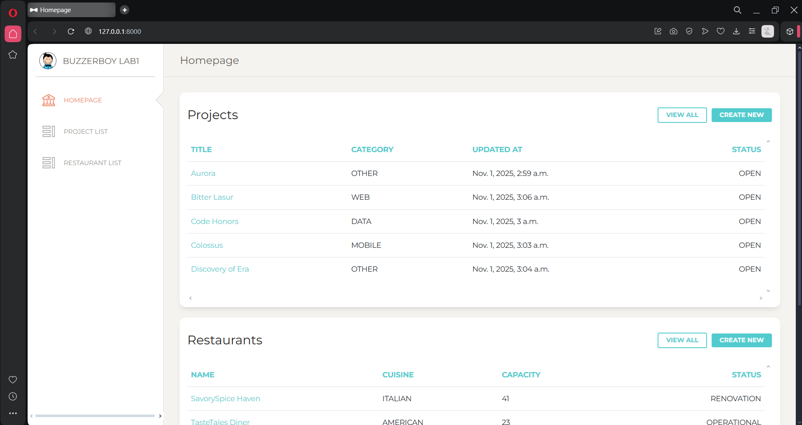

---

## Project List Page

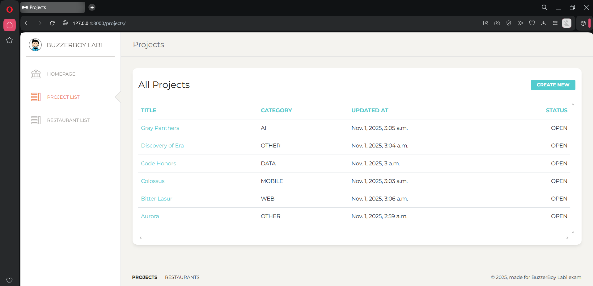

---

## Project Detail Page

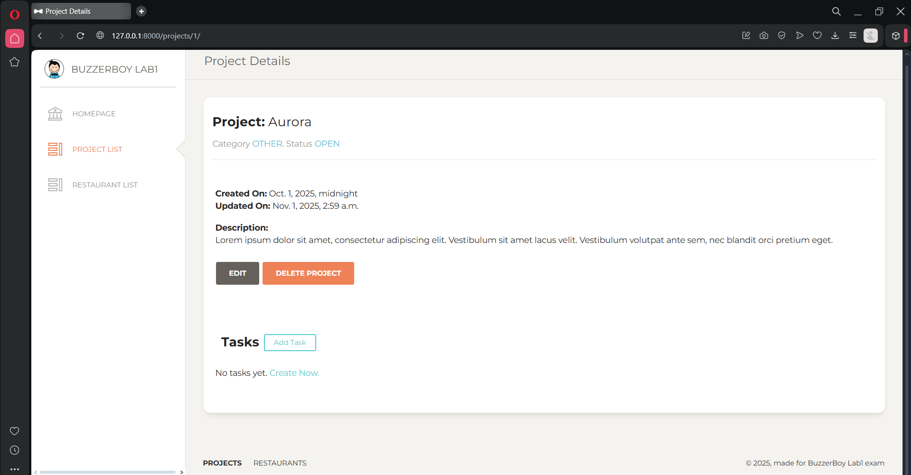

---

## Project Create Page

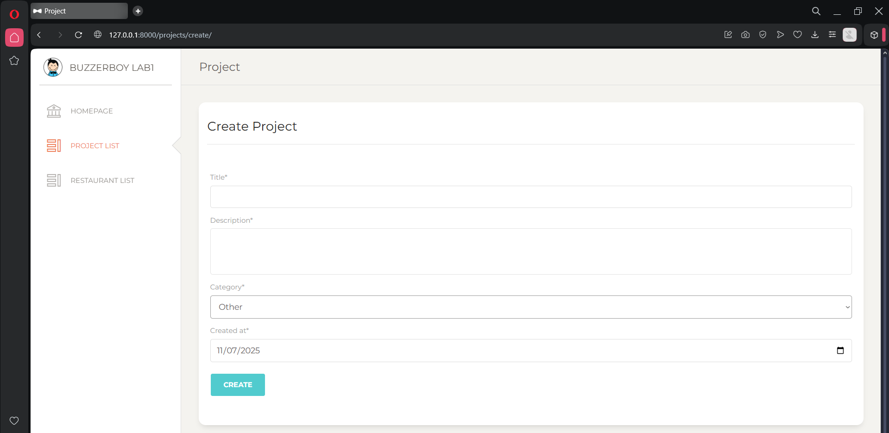

---

## Project Update Page

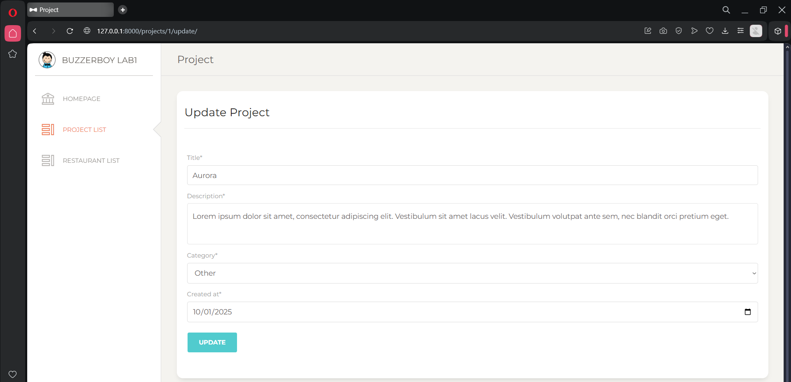

---

## Project Delete Page

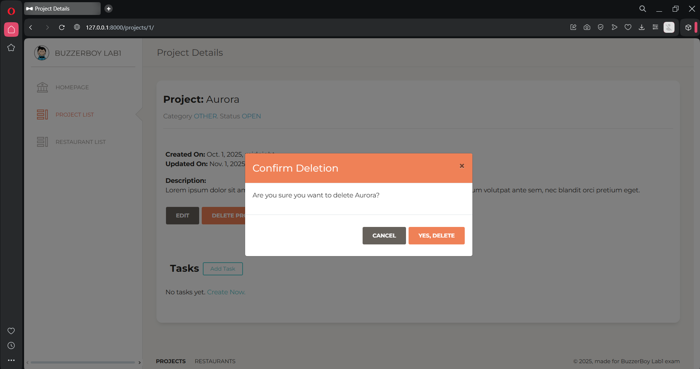

---

## Project Task List Page

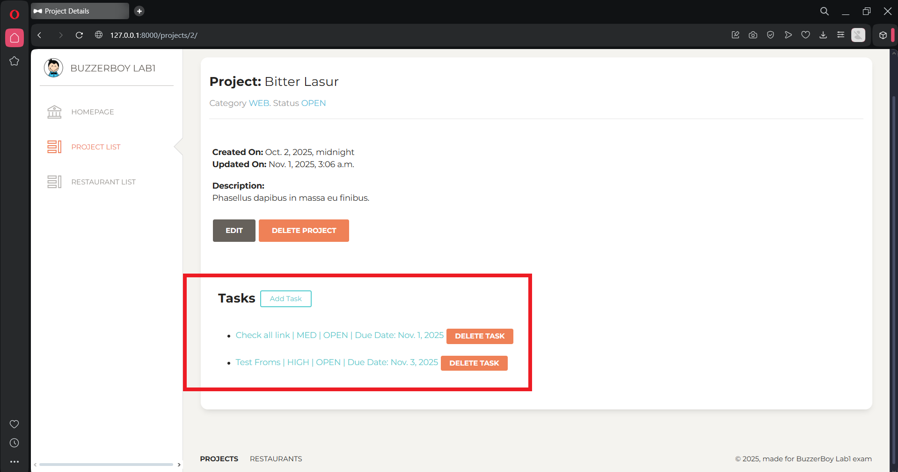

---

## Project Task Detail Page

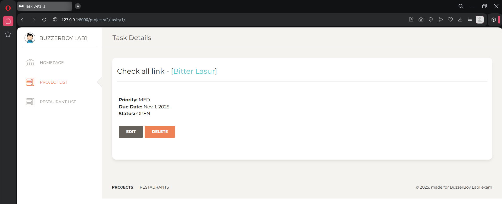

---

## Project Task Create Page


---

## Project Task Update Page

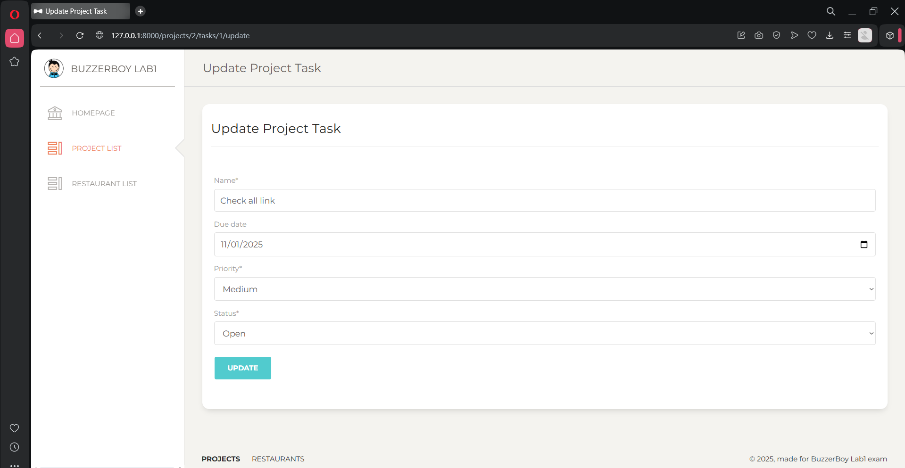

---

## Project Task Delete Page

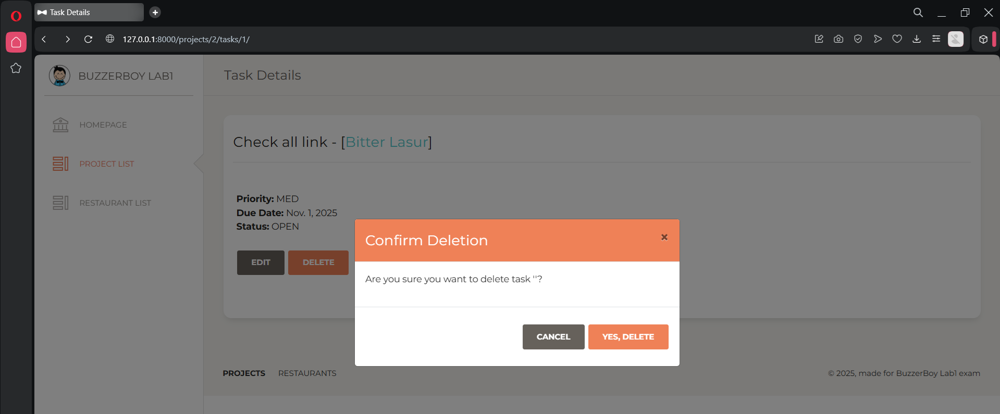

---

## Restaurant List Page

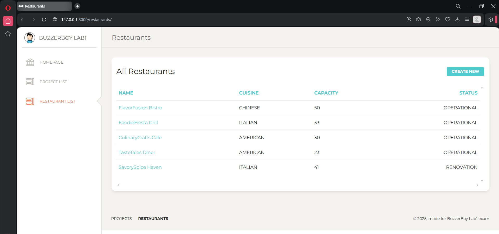

---

## Restaurant Detail Page

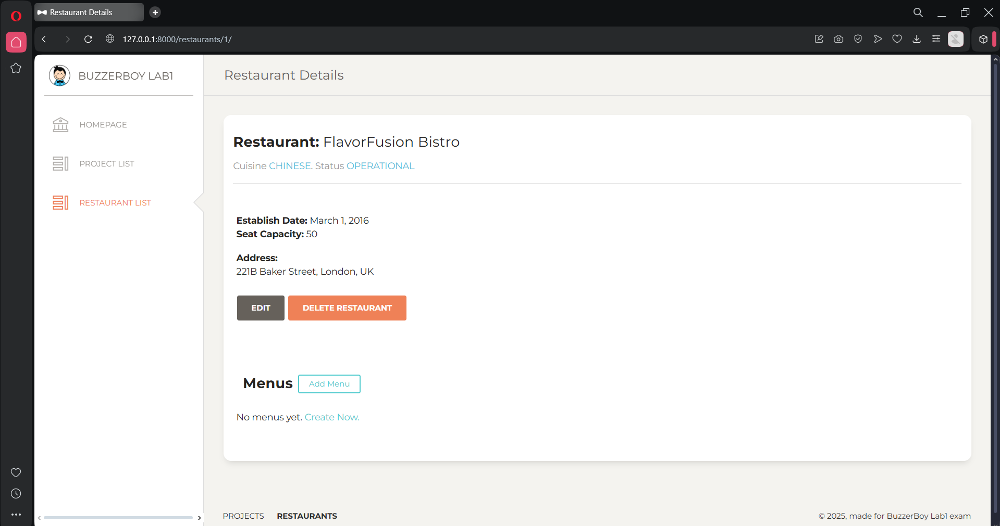

---

## Restaurant Create Page

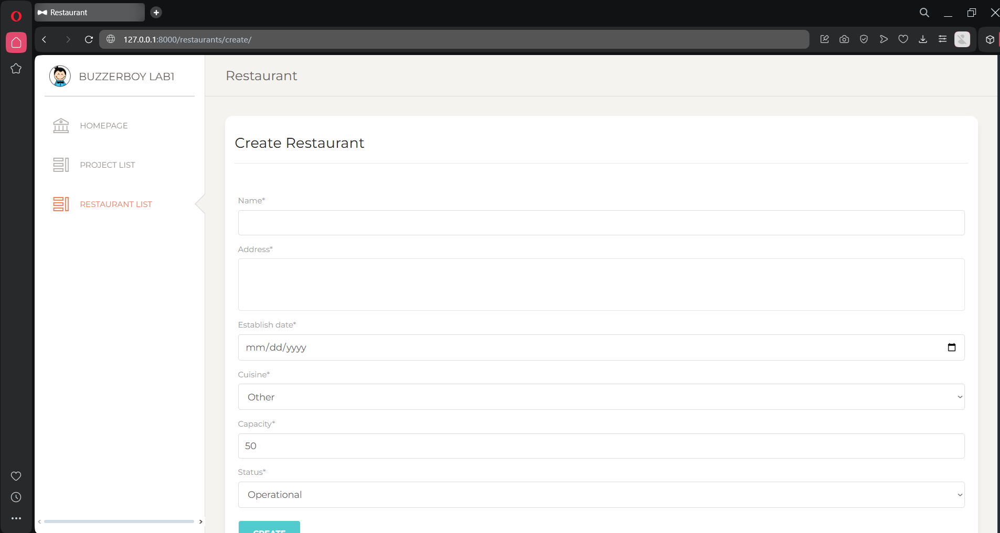

---

## Restaurant Update Page

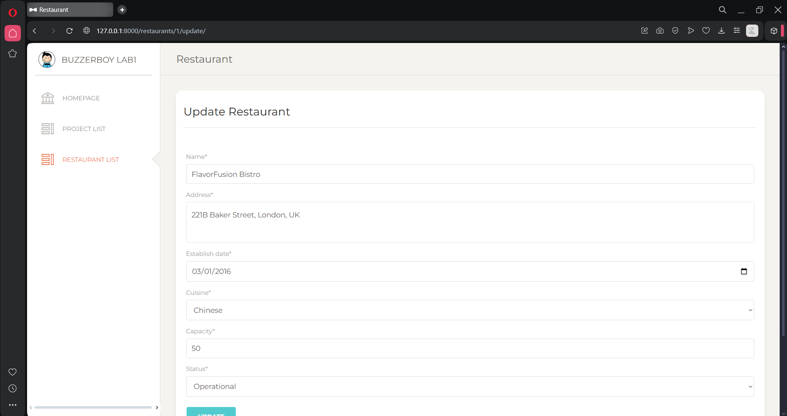

---

## Restaurant Delete Page

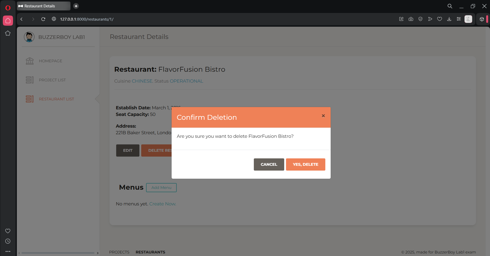

---

## Restaurant Menu List Page

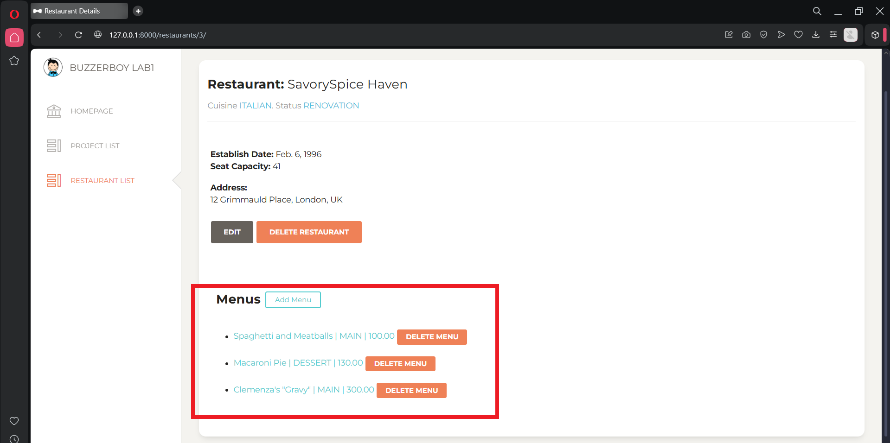

---

## Restaurant Menu Detail Page

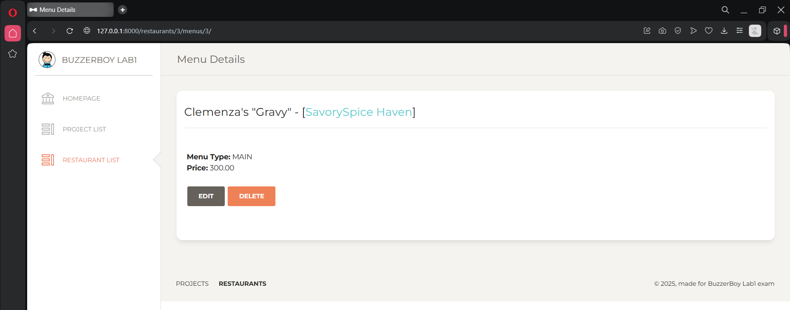

---

## Restaurant Menu Create Page

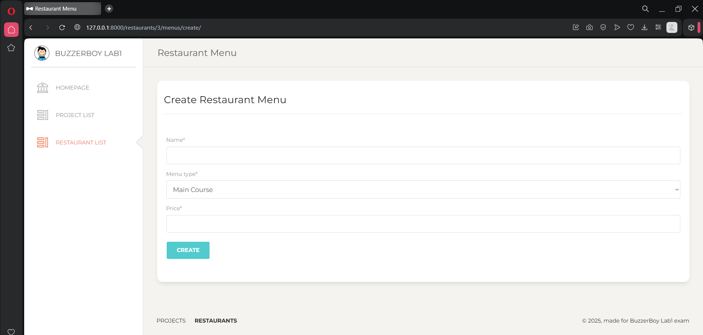

---

## Restaurant Menu Update Page

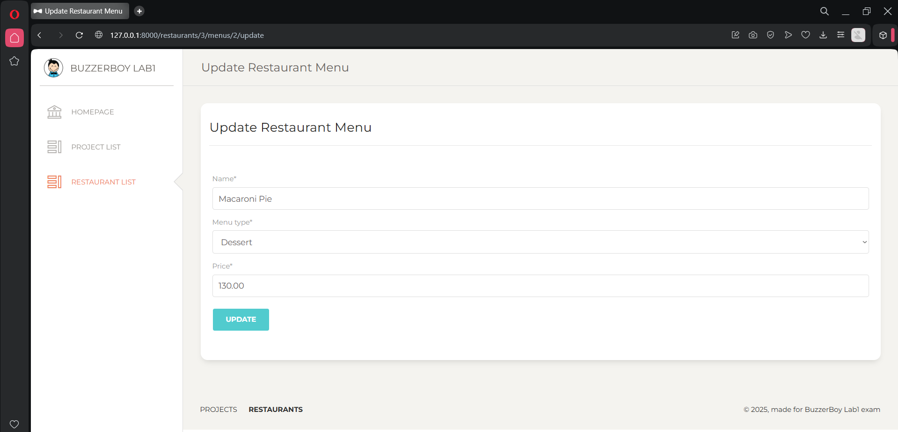

---

## Restaurant Menu Delete Page

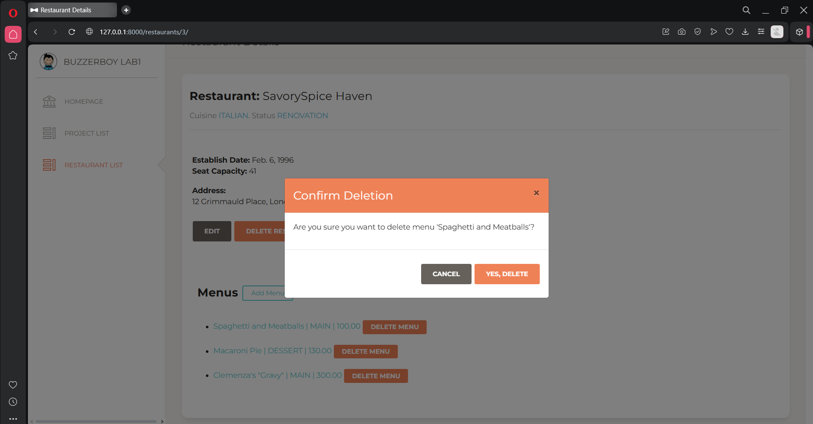

---

---

---

## Clone Project

```
git clone https://github.com/jmgcheng/buzzerboy-django-dev-testv4-lab1.git
cd buzzerboy-django-dev-testv4-lab1
```

## Setup

```
python -m venv venv
venv\Scripts\activate
pip install -r requirements.txt
python manage.py makemigrations
python manage.py migrate
```

## Run

```
python manage.py runserver
```

## Need to run specific Python environment?

Use Conda

```
conda create -n venv_conda_3.10 python=3.10 -y
conda activate venv_conda_3.10
```
